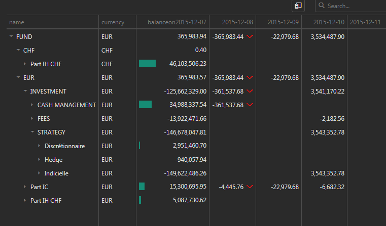
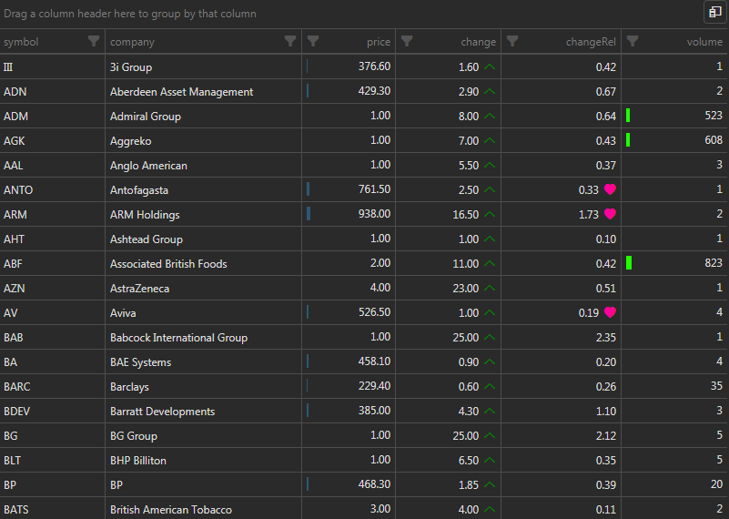
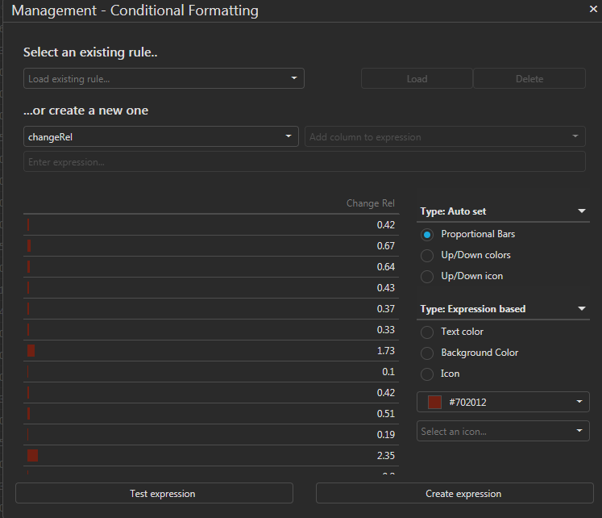
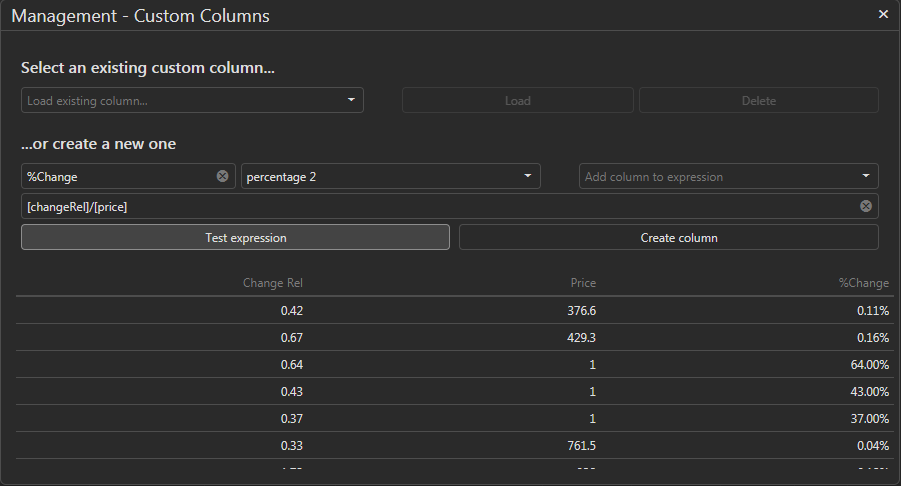
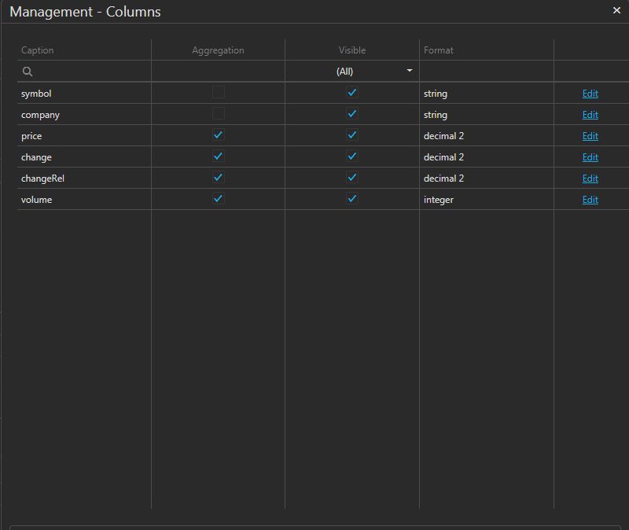

# dx.grid.extensions

A comprehensive wrapper around devexpress js grids which include conditional formatting features, expression editors, on the fly custom column creation and automatic schema creation.

## Conditionnal Formatting
# 

# 

# 

## Custom Column
# 

## Columns Management
# 
